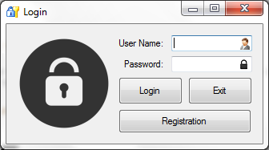
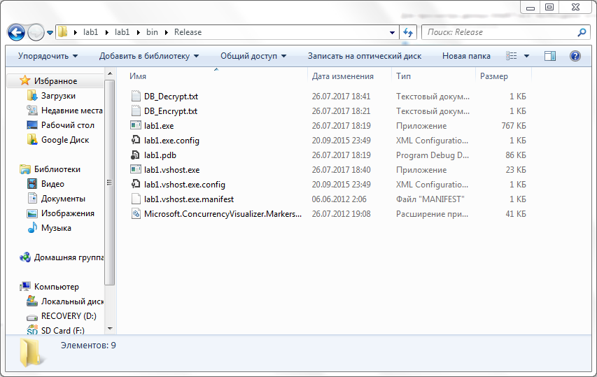
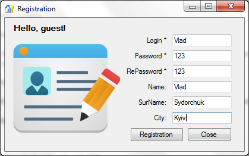
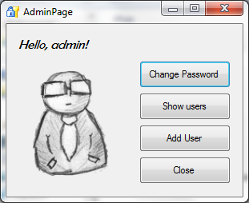
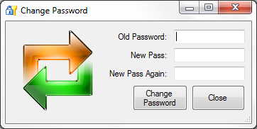
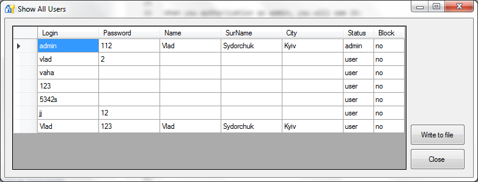
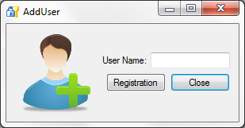
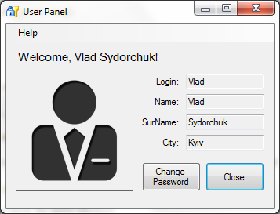

# Login Form #

In this project I implemented simple login form with some possibilities (use MD5 for encryption information).

### Main Form ###

When you run the program, you can see it: 

* Main window

In the folder will create file "DB_Decrypt" (if it first run, file exist information about 'admin') and then "DB_Encrypt" (when program is running)
If you close programm -> "DB_Encrypt" will be delete.

Next, you can authorization as admin or as user. But, before authorization as user, you must a registate.

If all ok, you will see message "Data export".

### Authorization as admin ###

When you authorization as admin, you will see it:

You can:

* Change password

* Show users (of course, you can change something here and 'write' to DB)

* Add user (if user with current login exist, you will see a message about it)

* Close (this window and back to main window)

### Authorization as user ###

When you authorization as admin, you will see it:

You can:

* Change password
* Show info